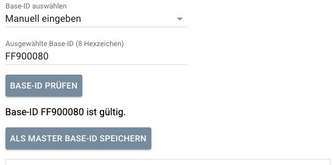
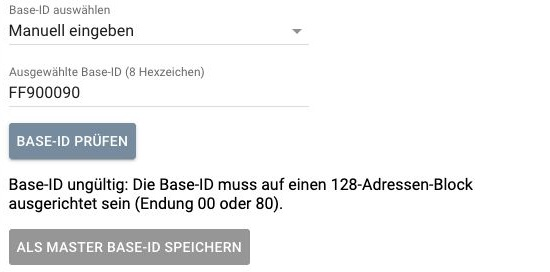

# Bedienungsanleitung

[Zur Übersicht und Installation](../README.md) · [Fehlerbehebung](fehlerbehebung.md)

Diese Anleitung beschreibt den veröffentlichten Benutzerweg: ein vorhandenes
natives EnOcean-Gateway in IP-Symcon auswählen, seine Base-ID verwalten und es
anschließend wieder an IP-Symcon zurückgeben.

## Voraussetzungen und Grenzen

- IP-Symcon: Das Modulmanifest nennt Version **9.0** als Voraussetzung.
- Ein bereits funktionierendes natives EnOcean-Gateway, direkt an einer aktiven
  Serial-Port-Instanz, im binären **ESP3-Modus**. ESP3 ist das Kommunikationsprotokoll
  zwischen IP-Symcon und dem Gateway.
- Serielle Einstellung: **8 Datenbits, keine Parität, 1 Stopbit**. Anschluss und
  Baudrate kommen aus der vorhandenen Konfiguration, nicht aus einer Modellannahme.
- Die serielle Schnittstelle darf nicht mit einem zweiten Gateway oder einer
  anderen Anwendung geteilt werden. Auch während der Wartung darf kein anderes
  Programm den Anschluss öffnen.
- Der implementierte Anschlussbesitznachweis benötigt Linux mit lesbaren
  Prozessinformationen unter `/proc`. Die aktuelle Prüfung verlangt einen
  als root laufenden Symcon-Prozess. Eingeschränkte Container, Windows und macOS
  sind kein freigegebener Wartungsweg. Ändern Sie nicht auf Verdacht Rechte oder
  Dienste, wenn die Prüfung fehlschlägt.

**Getestet und vom Maintainer praktisch abgenommen** wurde der Benutzerweg mit
einem TCM310 auf einem Raspberry Pi 5: frische Installation aus dem öffentlichen
Repository, Einrichtung, Auslesen und ein realer Base-ID-Schreibvorgang.
Das ist ein Nachweis für diesen Anwendungsfall, keine Zusage für jedes EnOcean-Gerät.

Andere ESP3-Modelle und regionale Varianten sind nicht pauschal freigegeben.
LAN/TCP, ESP2 und unbekannte Verbindungsketten werden im aktuellen Wartungsweg
abgewiesen. Die Base-ID-Änderung ändert weder Funkfrequenz noch Funkregion.
Das Modul bietet in diesem Benutzerweg keine Repeater-/Filter-Konfiguration,
Firmwareupdates oder direkten Speicherzugriffe an.

Die Installation aktiviert weder Symcon Connect noch eine Lizenz. Ihre
IP-Symcon-Installation muss unabhängig davon normal verwendbar sein.

## 1. Installation und Manager anlegen

1. Öffnen Sie **Module → Repository hinzufügen** in der Management Console.
2. Verwenden Sie:

   ```text
   https://github.com/Brutus79/EnOcean-Gateway_BaseID-Manager.git
   ```

3. Installieren Sie den Branch **main**.
4. Legen Sie über **Instanz hinzufügen** den Konfigurator **EnOcean Gateway Manager**
   an (technischer Name: **EnOcean Gateway Configurator**).
5. Markieren Sie in **Native EnOcean-Gateways / vorhandene Manager** das gewünschte
   vorhandene Gateway und klicken Sie **ERSTELLEN**. Die Konsole kann je nach
   Version leicht andere Beschriftungen für die Erstellaktion verwenden.
6. Öffnen Sie die erzeugte Managerinstanz. Ist bereits eine vorhanden, öffnen Sie
   diese, statt eine zweite für dasselbe Gateway anzulegen.

Der Konfigurator legt den Manager mit der ausgewählten Gatewayreferenz an.
Er erstellt nicht automatisch eine neue native EnOcean-Anbindung und startet
keine Wartung. Ihr Gateway muss vorher in IP-Symcon eingerichtet sein.

## 2. Das richtige Gateway auswählen

Das Feld **EnOcean-Gateway auswählen** bezeichnet die vorhandene native Instanz,
deren Base-ID Sie verwalten möchten. Kontrollieren Sie die Auswahl vor jedem Einsatz.
Bei einer direkten Manageranlage ohne vorausgewählte Referenz wählen Sie das
Gateway ausdrücklich aus und übernehmen die Konfiguration.

Es gibt kein automatisches Umschalten auf ein vermeintlich passendes Gateway.
Ein vorhandener Listeneintrag bestätigt nur seine Existenz, noch nicht die sichere
Verwendbarkeit der aktuellen Anbindung. Diese wird beim Wartungsstart neu geprüft.

Ohne Auswahl zeigt das Modul eine Aufforderung zur Gateway-Auswahl; die Wartung
ist nicht verfügbar. Der Systembutton **Gateway ändern** oben in der Konsole
betrifft die technische Parent-Beziehung. Er ist nicht das Auswahlfeld des Managers.

## 3. Gateway lesen und Wartung beginnen

Klicken Sie auf **Gateway prüfen und Base-ID verwalten**.
Das Modul übernimmt den Anschluss kontrolliert und liest Geräteinformationen,
Base-ID und Zähler wiederholt auf Konsistenz. Warten Sie auf:

> Gateway bereit zur Base-ID-Verwaltung.

Währenddessen und während der anschließenden Wartung nutzt IP-Symcon das betreffende
Gateway nicht für seine normale EnOcean-Kommunikation. Wählen Sie deshalb einen
geeigneten Zeitpunkt. Öffnen oder ändern Sie parallel weder den Serial Port noch
die native Gatewaykonfiguration.

Eine intakte Wartungssitzung hat kein bloßes Benutzer-Zeitlimit. Änderungen an
Verbindung, Gerät oder Anschlussbesitz sowie Kommunikationsfehler können sie aber
sofort ungültig machen. Historische Werte oder eine alte Sitzung ersetzen die
erneute Hardwareprüfung nicht.

### Angezeigte Informationen

- **Aktuelle Base-ID des Gateways:** der in der gültigen Wartung gelesene Hardwarewert.
- **Verbleibende Änderungen:** der vom Gateway gemeldete Schreibzähler.
- Unter **Technische Details**: eindeutige Radio-ID (**EURID**), Firmware-Version,
  API-Version, Device-Version in Hexdarstellung und Firmware-Beschreibung,
  soweit erfolgreich ermittelt.

Die Radio-ID identifiziert den Chip; sie ist nicht die Master Base-ID und wird
nicht durch das Übernehmen einer Base-ID ersetzt. Gatewaygeneration und Funkregion
werden nicht zuverlässig automatisch ermittelt und entsprechend bezeichnet.
Fehlende Informationen werden nicht geschätzt.

Nach der Rückgabe lautet die Base-ID-Anzeige **Zuletzt gelesene Base-ID**.
Auch der danebenstehende Zähler gehört dann zur letzten Messung, nicht zu einem
laufend neu ausgelesenen Gateway. Für aktuelle Hardwarewerte starten Sie eine neue
kontrollierte Prüfung.

## 4. Aktuelle Base-ID, Master, Sicherung und Ziel unterscheiden

| Wert | Woher kommt er? | Wozu dient er? |
| --- | --- | --- |
| Aktuelle Gateway-Base-ID | Vom angeschlossenen Gateway gelesen. | Zeigt den tatsächlichen Hardwarezustand während der gültigen Wartung. |
| Master Base-ID | Bewusst über **ALS MASTER BASE-ID SPEICHERN** festgelegt. | Ihre lokale Referenz, beispielsweise die gewünschte dauerhafte Adresse der Anlage. |
| Gesicherte Base-ID | Über **Aktuelle Base-ID sichern** aus dem Gateway übernommen. | Lokale Sicherung mit zugehörigen Metadaten; kein Hardware-Schreibauftrag. |
| Historie | Lokal bekannte frühere Base-IDs mit Datum, soweit vorhanden. | Nachvollziehen und bewusst wieder auswählen. Kein Nachweis des aktuellen Gerätezustands. |
| Gewünschte Gateway-Base-ID | Von Ihnen ausgewählt, geprüft und als Ziel vorbereitet. | Geplante Hardwareänderung, die noch ausdrücklich bestätigt werden muss. |

Die Übersicht finden Sie unter **Gespeicherte Base-IDs**. Das Lesen eines Gateways
oder Speichern einer Sicherung legt nicht automatisch Ihren Master neu fest.
Eine Hardwareänderung überschreibt ebenfalls nicht automatisch Ihren Master.

### Gelesene Base-ID sichern

Während einer erfolgreich geprüften Wartung öffnen Sie **Gespeicherte Base-IDs**
und klicken auf **Aktuelle Base-ID sichern**. Der Wert wird lokal gespeichert,
ohne die Hardware oder deren Zähler zu ändern. Eine ungültige Sitzung oder ein
noch nicht zugeordnetes Austauschgateway verhindert diese Aktion.

### Lokale Sicherung löschen

Unter **Technische Details → Lokale Sicherung löschen** können Sie die Sicherung
entfernen. Dies löscht die Sicherung und ihre Metadaten, nicht Master oder Historie.
Es setzt niemals den Hardwarezähler zurück und verändert keine Daten im Chip.
Notieren Sie einen weiterhin benötigten Sicherungswert vorher zusätzlich.

Bewahren Sie wichtige Referenzwerte auch außerhalb der Modulansicht auf und
sichern Sie Ihre IP-Symcon-Installation. Die lokale Historie allein ist kein
Ersatz für ein Systembackup oder ein universell geprüftes Import-/Restore-Verfahren.

## 5. Eine Base-ID auswählen und prüfen

Verwenden Sie die **eine gemeinsame Auswahl** im Arbeitsbereich:

- **Manuell eingeben:** Tragen Sie den Wert in **Ausgewählte Base-ID (8 Hexzeichen)** ein.
- **Master Base-ID:** erscheint, wenn bereits ein Master gespeichert ist.
- **Aus der Historie auswählen:** erscheint, wenn historische Werte vorhanden sind.
  Anschließend wählen Sie den konkreten Eintrag unter **Base-ID aus der Historie**.

Klicken Sie danach auf **BASE-ID PRÜFEN**. Die Prüfung arbeitet nur mit dem
ausgewählten Wert. Sie schreibt und liest keine Gatewayhardware und verändert
weder Master noch Sicherung oder Schreibzähler.

### Gültigkeitsregeln

1. **Format:** genau acht Hexzeichen; zulässig sind `0–9` und `A–F`.
   Kleinbuchstaben werden akzeptiert und groß dargestellt. Ein optionales `0x`
   am Anfang sowie äußere Leerzeichen werden entfernt; interne Trennzeichen nicht.
2. **Wertebereich:** `FF800000` bis `FFFFFF80`, einschließlich beider Grenzen.
3. **128er-Ausrichtung:** Die Adresse muss am Anfang eines 128-Adressen-Blocks
   liegen. An den letzten beiden Hexzeichen erkennen Sie das einfach: **`00` oder `80`**.
   Das Modul rundet einen anderen Wert nicht heimlich auf einen passenden Block.

| Neutraler Beispielwert | Ergebnis |
| --- | --- |
| `FF900080` | Gültiges Format, zulässiger Bereich und passende Ausrichtung. |
| `FF900090` | Ungültig: Endung `90` statt `00` oder `80`. |
| `12345678` | Ungültig: außerhalb des zulässigen Bereichs. |
| `FF90008` | Ungültig: nur sieben Hexzeichen. |

Diese Beispiele sind **keine empfohlenen Hardwareadressen**. Ein formal gültiger
Wert kann für Ihre Anlage trotzdem der falsche sein. Für einen Gatewaytausch ist
typischerweise die bewusst gesicherte bisherige Base-ID relevant.



*Die Prüfung bestätigt den konkreten Wert. Sie führt keinen Hardware-Write aus.*



*Ein ungültiger Wert erhält eine verständliche Meldung; lokales Speichern bleibt gesperrt.*

Nach erfolgreicher Prüfung erscheint beispielsweise **Base-ID FF900080 ist gültig.**
Die nachfolgenden Aktionen gelten ausschließlich für diesen geprüften Wert.
Ändern Sie Eingabe, Quelle oder Historieneintrag, müssen Sie erneut prüfen.
Auch das erneute Öffnen des Formulars setzt den Prüfstatus zurück.

## 6. Geprüfte Auswahl lokal als Master speichern

Wählen und prüfen Sie einen manuellen Wert oder einen Historieneintrag.
Klicken Sie dann auf **ALS MASTER BASE-ID SPEICHERN**.
Die Meldung bestätigt die lokale Speicherung; das Gateway bleibt unverändert.

Das ist auch außerhalb einer aktiven Wartung möglich, sofern das Modul die lokale
Aktion zulässt. Wenn die Quelle bereits der gespeicherte Master ist, ist erneutes
Speichern dieses Masters nicht nötig und die Aktion nicht freigegeben.

**Master speichern ist nicht Gateway schreiben.** Um den Wert wirklich auf das
Gateway zu übertragen, ist der gesonderte Ablauf im nächsten Abschnitt nötig.

## 7. Geprüfte Auswahl als Gateway-Ziel vorbereiten

Beginnen Sie zunächst die Wartung und warten Sie auf den bereiten Zustand.
Wählen Sie den gewünschten Wert und prüfen Sie ihn. Klicken Sie anschließend auf
**Auswahl als gewünschte Gateway-Base-ID vorbereiten**.

Unter **Geplante Änderung** sehen Sie:

- die aktuelle Hardware-Base-ID,
- die gewünschte neue Base-ID,
- die verbleibenden Änderungen vorher und den erwarteten Wert danach.

Ein Ziel, das bereits der aktuellen Hardware-Base-ID entspricht, wird nicht
erneut geschrieben. Bei unbekanntem Zähler oder verletzter Reserve kann keine
Änderung vorbereitet werden. Vorbereitung allein ist noch kein Hardware-Write.

## 8. Die Hardware-Base-ID bewusst ändern

> **Dieser Abschnitt beschreibt einen echten Hardware-Schreibvorgang.**
> Prüfen Sie Gateway, Zielwert und Zähler. Ein anschließendes Zurückschreiben wäre
> ein weiterer Hardware-Schreibvorgang und würde einen weiteren Zyklus verbrauchen.

1. Kontrollieren Sie die Werte unter **Geplante Änderung**.
2. Klicken Sie auf **Gewünschte Base-ID schreiben**. Diese erste Bestätigung öffnet
   die zweite Stufe; sie sendet noch kein Hardware-Schreibkommando.
3. Kontrollieren Sie unter **Base-ID wirklich ändern?** die Werte erneut und lesen
   Sie den Hinweis zum erwarteten Zähler.
4. Nur wenn Sie die Änderung tatsächlich wollen, klicken Sie auf **Jetzt schreiben**.
   **Das ist die abschließende Benutzerfreigabe.** Danach kann das Modul nach seinen
   erneuten Sicherheitsprüfungen den Hardware-Schreibvorgang ausführen.
5. Lassen Sie den Prüf- und Schreibablauf abschließen. Währenddessen nicht neu
   bestätigen, Dienste neu starten, Geräte abziehen oder Verbindungen umkonfigurieren.

Vor dem Senden liest das Modul Gerätedaten, Base-ID und Zähler erneut, unter anderem
in fünf vollständigen Vergleichsrunden. Auch Anschlussbesitz und unveränderter
Wartungskontext werden kontrolliert. Bei einer echten Kontextänderung wird die
Freigabe verworfen. Eine intakte Sitzung verliert die Benutzerbestätigung dagegen
nicht allein durch verstrichene Zeit; neue Hardwareprüfungen bleiben erforderlich.

Vor der abschließenden Freigabe können Sie mit **Zurück zur Auswahl** abbrechen.
Nach einem möglichen Sendversuch ist Abbrechen nicht gleichbedeutend mit
„nichts geschrieben“. Es erfolgt **keine automatische Schreibwiederholung**.

### Was gilt als erfolgreicher Write?

Eine positive Kommandoantwort allein reicht nicht. Das Modul muss einen tatsächlichen
Verbindungsabbau und eine neue Verbindung beobachten und anschließend wiederholt
feststellen:

- Es ist weiterhin derselbe Chip (gleiche Radio-ID).
- Die gelesene Base-ID ist exakt der gewünschte neue Wert.
- Bei einem begrenzten Zähler ist genau der erwartete, um eins reduzierte Wert vorhanden.
  Meldet das Gateway unbegrenzte Änderungen, gibt es keinen endlichen Zählerabfall.

Erst dann gilt die Hardwareänderung als verifiziert. Kontrollieren Sie die neu
angezeigte Base-ID und die verbleibenden Änderungen, bevor Sie die Wartung beenden.
Eine Meldung über einen gesendeten Vorgang oder ein betriebsbereiter Manager allein
ist kein Ersatz für diese Ergebnisprüfung.

Bei unklarem Ausgang bleiben weitere Änderungen gesperrt. Es kann sein, dass das
Gateway bereits geändert wurde, obwohl eine Antwort verloren ging. Beachten Sie
die [Fehlerhilfe](fehlerbehebung.md#unklarer-schreibausgang) und lösen Sie keinen
erneuten Schreibversuch auf Verdacht aus.

## 9. Verbleibende Änderungen verstehen

Der Zähler wird direkt vom Gateway gelesen, nicht aus der lokalen Historie berechnet.
Bei TCM3xx/TCM4xx ist die Base-ID laut EnOcean höchstens zehnmal änderbar; diese
Grenze lässt sich nicht zurücksetzen. Das ist keine pauschale Aussage über andere
Generationen oder über andere Gatewayeinstellungen.

Für einen **begrenzten** Zähler hält das Modul eine Mindestreserve von **fünf** ein:

| Gemeldete verbleibende Änderungen | Änderung auf einen anderen Wert |
| --- | --- |
| `8` | Möglich, sofern alle weiteren Prüfungen bestehen; erwartet wird `7`. |
| `6` | Möglich, sofern alle weiteren Prüfungen bestehen; erwartet wird `5`. |
| `5` oder weniger | Gesperrt: Die Reserve würde unterschritten. |
| Nicht verfügbar | Gesperrt: kein zuverlässiger Hardwarezähler. |
| Unbegrenzt | Das Gateway meldet den Sonderwert `FF`; kein endlicher Zähler wird erfunden. |

Sichern, Master speichern, Historie auswählen und **BASE-ID PRÜFEN** verbrauchen
keinen Hardware-Schreibzyklus. Auch Löschen der lokalen Sicherung setzt den
Hardwarezähler niemals zurück.

## 10. Wartung beenden und an IP-Symcon zurückgeben

Klicken Sie auf **Wartung beenden**, sobald Ihre Arbeiten oder die Ergebnisprüfung
abgeschlossen sind. Das Modul stellt die ursprüngliche native Verbindung und
deren Konfiguration kontrolliert wieder her und prüft den Anschlussbesitz.
Warten Sie auf:

> Wartung beendet. Gateway wieder an IP-Symcon übergeben.

Danach läuft keine zusätzliche, normalerweise ein bis zwei Minuten dauernde
Einbindungsprüfung des Managers. Die technisch notwendige Rückgabe kann dennoch
Zeit benötigen oder bei einem realen Fehler stoppen. Eine Warnmeldung ist nicht
als erfolgreiche Rückgabe zu behandeln.

Diese Rückgabe ist **nicht** die Ergebnisprüfung nach einem Write. Die neue
Hardware-Base-ID muss zuvor separat verifiziert worden sein. Die Rückgabeanzeige
ist auch kein Nachweis jedes einzelnen Funkgeräts oder einer zusätzlichen Prüfung
der nativen Senderadresse. Kontrollieren Sie Ihre normale Anlagenfunktion bei
Bedarf unabhängig davon.

## 11. Ein Gateway ersetzen und die bisherige Base-ID behalten

1. Am alten Gateway: Lesen Sie die Base-ID in einer gültigen Wartung aus, sichern
   Sie sie lokal und legen Sie die gewünschte bisherige Adresse bewusst als Master
   fest. Notieren Sie den Wert zusätzlich. Beenden Sie die Wartung.
2. Tauschen und richten Sie das neue Gateway außerhalb einer aktiven Wartung im
   normalen IP-Symcon-Betrieb ein. Es muss den unterstützten Anschlussweg besitzen.
3. Kontrollieren Sie im Manager die native Gateway-Auswahl. Bei einer neu angelegten
   nativen Instanz wählen Sie diese ausdrücklich aus; es erfolgt kein stilles Umschalten.
4. Starten Sie eine neue Gatewayprüfung. Ein anderer Chip wird als Hardwarewechsel
   angezeigt. Öffnen Sie **Gespeicherte Base-IDs** und verwenden Sie bei entsprechendem
   Hinweis **Neues Gateway zuordnen und aktuelle Base-ID sichern**. Dadurch wird der
   neue Chip bewusst zugeordnet und seine aktuelle Base-ID lokal gesichert.
   Der bisherige Master und die bisherigen Historieneinträge bleiben erhalten.
5. Wählen Sie den bisherigen Master oder einen bewusst kontrollierten Historienwert,
   prüfen Sie ihn erneut und bereiten Sie ihn als Ziel vor. Ist der neue Hardwarewert
   bereits identisch, ist kein weiterer Write nötig.
6. Für eine notwendige Änderung folgen Sie den beiden Bestätigungen, prüfen das
   Hardwareergebnis und beenden anschließend die Wartung.

Eine neue Managerinstanz hat nicht automatisch Ihre alte Master-Auswahl. Die lokale
Zuordnung und Aufbewahrung wichtiger Werte müssen vor einem Austausch bzw. einer
Neuinstallation nachvollziehbar sein. Eine alte Historie bestätigt weder die neue
Chipidentität noch den aktuellen Zähler.

Die Übernahme der Base-ID kann passende bestehende Zuordnungen erhalten. Sie ist
keine Garantie, dass jedes Gerät, jede Anlernung oder jede denkbare Gatewaykonfiguration
ohne weitere Kontrolle übertragbar ist.

## Hilfe und Herkunft der Bilder

Bei Störungen: [Fehlerbehebung](fehlerbehebung.md).

Die beiden Bilder sind echte Ausschnitte der veröffentlichten Manageroberfläche.
Sie zeigen ausschließlich lokale Validierung neutraler Beispielwerte außerhalb
einer Wartung. Deshalb ist dort kein Button zur Zielvorbereitung zu sehen; dieser
erscheint erst in der bereiten Wartung. Geräte- und Systemidentitäten wurden durch
den Ausschnitt ausgeschlossen. Für diese Dokumentation wurde kein Hardware-Write
ausgeführt und kein Schreibkommando gesendet.
